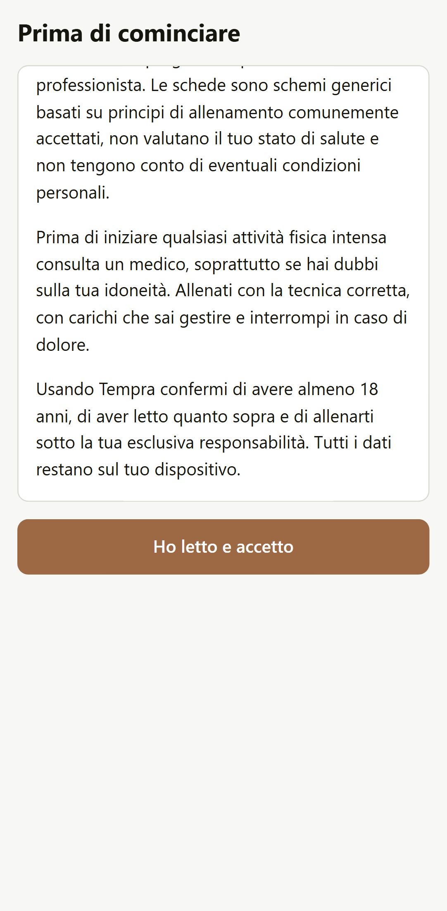
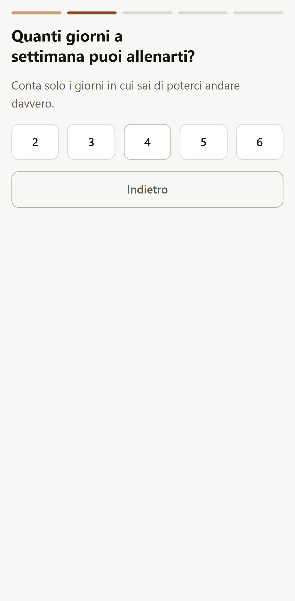
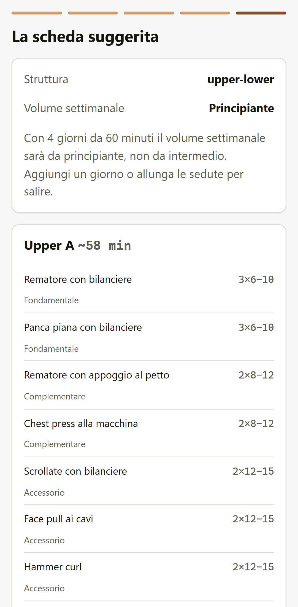
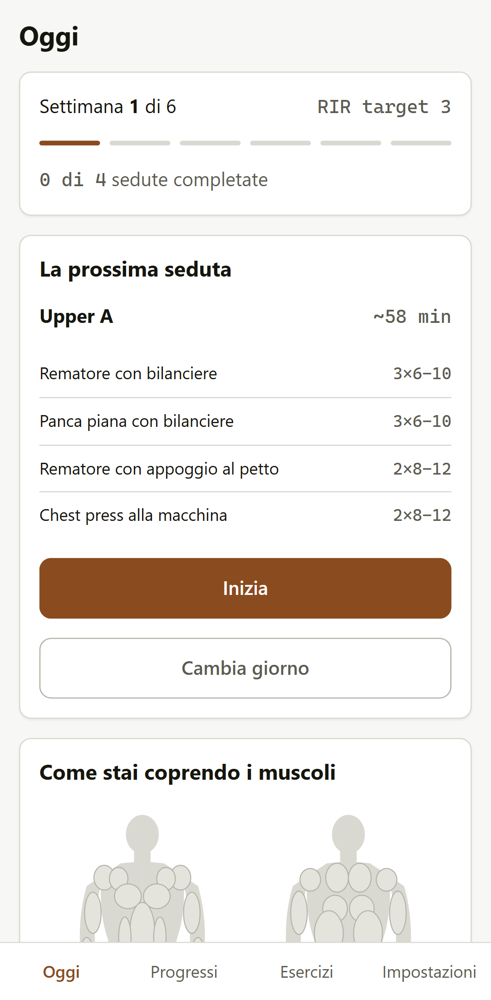
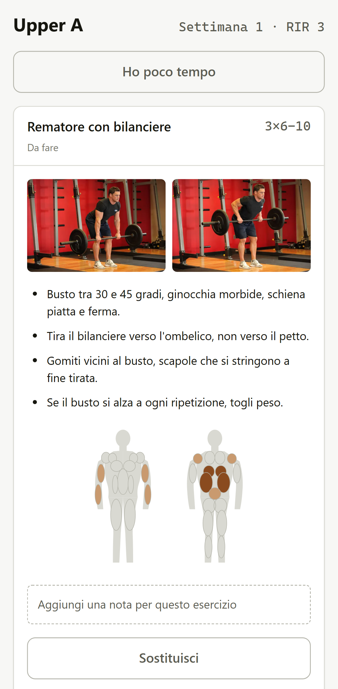
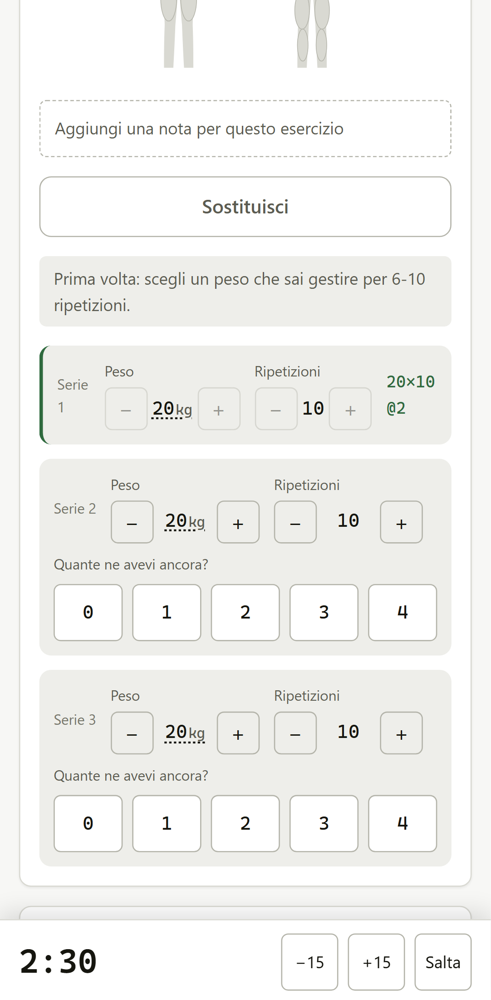

<!-- Tempra v1.0.0 — 2026-09-04 14:30 -->

# Tempra

PWA per l'allenamento con i pesi in palestra. Quattro domande, una scheda
periodizzata di sei settimane, la sessione guidata serie per serie, e la scheda
successiva che si adatta a come sono andate le serie precedenti.

**Tutto gira sul dispositivo.** Nessun server, nessun account, nessun dato in
uscita: dopo il caricamento degli asset l'app non fa nessuna richiesta di rete.

> [!IMPORTANT]
> Tempra è uno strumento per organizzare l'allenamento in palestra. Non è un
> servizio medico né un programma personalizzato da un professionista. Le
> schede sono schemi generici basati su principi di allenamento comunemente
> accettati, non valutano il tuo stato di salute e non tengono conto di
> eventuali condizioni personali.
>
> Prima di iniziare qualsiasi attività fisica intensa consulta un medico,
> soprattutto se hai dubbi sulla tua idoneità. Allenati con la tecnica corretta,
> con carichi che sai gestire e interrompi in caso di dolore.
>
> Usando Tempra confermi di avere almeno 18 anni e di allenarti sotto la tua
> esclusiva responsabilità.

## Stato

**v1.0.0.** Tutte le sette fasi della sezione 11 di `spec.md` sono chiuse.
L'app è installabile sul telefono e funziona senza rete.

| Fase | Contenuto | Tag |
| --- | --- | --- |
| 0 | Scaffolding, schema IndexedDB, test, CI | `v0.1.0` ✅ |
| 1 | Catalogo esercizi, immagini, mappa muscolare | `v0.2.0` ✅ |
| 2 | Motore di generazione della scheda | `v0.3.0` ✅ |
| 3 | Onboarding e Home | `v0.4.0` ✅ |
| 4 | Sessione guidata | `v0.5.0` ✅ |
| 5 | Progressione e modalità "poco tempo" | `v0.6.0` ✅ |
| 6 | Progressi, catalogo, impostazioni | `v0.7.0` ✅ |
| 7 | PWA, service worker, rilascio | `v1.0.0` ✅ |

## Com'è fatta

| | | |
| --- | --- | --- |
|  |  |  |
| Disclaimer bloccante | Quattro domande, cinque tap | Anteprima prima di salvare |
|  |  |  |
| La seduta di oggi e la mappa muscolare | Immagini, cue, note, serie | Recupero che scorre in background |

Gli screenshot si rigenerano con `npm run make:shots` mentre gira `npm run dev`:
non si aggiornano a mano.

## Installarla sul telefono

Non c'è nessuno store. Si apre l'indirizzo nel browser del telefono e si sceglie
"Aggiungi alla schermata Home": da lì in poi si comporta come un'app, a schermo
intero e senza barra degli indirizzi.

Al primo caricamento scarica tutto quello che le serve — codice, immagini degli
esercizi, catalogo — e da quel momento funziona **senza rete**. In palestra,
dove il segnale spesso non arriva, è la condizione normale, non l'eccezione.

## Sviluppo

```bash
npm install
npm run dev
```

| Comando | Cosa fa |
| --- | --- |
| `npm run dev` | Server di sviluppo su `localhost:5173` |
| `npm run build` | Build di produzione in `dist/` |
| `npm test` | Test unitari (Vitest) |
| `npm run test:e2e` | Test end-to-end (Playwright) |
| `npm run lint` | ESLint |
| `npm run import:exercises` | Riscarica le immagini degli esercizi (a mano, non in CI) |
| `npm run make:icons` | Rigenera le icone della PWA |
| `npm run make:shots` | Rigenera gli screenshot del README |

## Crediti degli asset

Le immagini degli esercizi vengono da
[Free Exercise DB](https://github.com/yuhonas/free-exercise-db)
(yuhonas/free-exercise-db), rilasciato con licenza **Unlicense**, quindi di
pubblico dominio. Sono ridimensionate a 600 px e convertite in WebP da
`scripts/import-exercises.mjs`. Ogni esercizio del catalogo porta la propria
licenza nel campo `license`, e un test verifica che nessuno ne sia sprovvisto.

I cue tecnici e la mappa muscolare `body.svg` sono originali di questo
repository, sotto licenza MIT. Quattro esercizi non hanno immagini perché la
sorgente non offre una corrispondenza fedele: si usano i soli cue testuali.

## Struttura

```
src/
├── version.js      unica fonte della versione applicativa
├── App.jsx         routing hash e guardia sul disclaimer
├── db/             IndexedDB: schema, migrazioni, CRUD
├── engine/         motori puri e testabili: generazione, progressione, riduzione
├── data/           catalogo esercizi, SVG anatomico, stringhe italiane
├── ui/             schermate, componenti, hook
└── styles/         token di design e stili di base
```

Interfaccia in italiano, codice e commenti in inglese solo dove servono nomi
tecnici; i commenti esplicativi sono in italiano perché il progetto è personale.
Le scelte prese in fase di implementazione sono annotate in
[DECISIONS.md](DECISIONS.md).

## Licenza

[MIT](LICENSE). Il software è fornito **così com'è**, senza garanzia di alcun
tipo, esplicita o implicita. Chi lo usa se ne assume per intero il rischio: gli
autori non rispondono di alcun danno derivante dall'uso del software.
